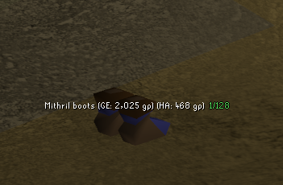
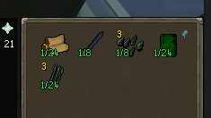
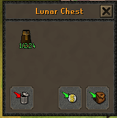
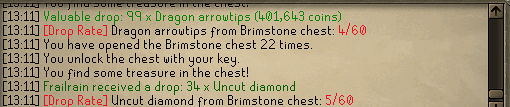

# Drop Rate Display

A [RuneLite](https://runelite.net) plugin that shows the OSRS Wiki drop rate of loot you receive,
wherever it appears — on the ground, on a reward screen, or in your inventory.

There is **no dependency on the Loot Tracker plugin**. Monster drops come from RuneLite's core
`LootManager`; everything else is detected directly from game messages, reward interfaces and menu
actions.

## Screenshots

*Floor drops — every item on a stack gets its own rate, flush after its Ground Items line:*



*Reward screens — the rate is painted on each item (clue caskets, chests, raids, the Perilous Moons
Lunar Chest, and more):*





*Inventory loot — the rate is also printed to chat (here, a Brimstone chest):*



## Where the rate shows

- **Floor drops** (monsters and bosses) — with the core **Ground Items** plugin on, the rate is placed
  flush after each item's line (`Mithril boots (GE: 2,025 gp) 1/128`), aligned per item so a pile of 2+
  drops each gets its own rate. This reproduces Ground Items' own layout from public data (no reflection,
  no dependency). Without Ground Items, turn off *Merge with Ground Items* for a self-labelled
  `Ensouled goblin head (1/35)` line.
- **Reward screens** — the rate is painted directly on each item on the reward interface: Barrows,
  Chambers of Xeric, Theatre of Blood, Tombs of Amascut, Perilous Moons (Lunar Chest), Fortis Colosseum,
  Fishing Trawler, Drift Net and clue caskets.
- **Inventory loot** — a chat line plus the rate on the item's icon for ~30 seconds. Covers:
  - Pickpockets and ship salvage
  - World chests — Brimstone, Crystal, Larran's, Elven, Grubby, Muddy, Ancient Vault, and more
  - Opened containers — caskets, lockboxes, gem bags, Camdozaal/frozen caches, potion packs, the
    Mahogany Homes supply crate, Soul Wars spoils, seed packs, and any other item whose name has a
    wiki drop table
  - Skilling minigames — Tempoross, Guardians of the Rift, Wintertodt
  - Herbiboar and the Unsired

Rates read from the wiki (`1/512`, `100/2,440`, `Always`, `Uncommon`). On the roomy ground line and in
chat the full wiki rate is shown; on the space-constrained item icons it's normalised to a rounded
`1/N` (`100/2,440` → `1/24`).

## Configuration

Settings are grouped into four sections:

- **Displays** — where rates appear (ground items, chat, inventory items, reward screens) and *Merge
  with Ground Items* (append the rate to each Ground Items line, or draw a self-labelled line).
- **Filters** — *Minimum rarity* (only show `1/N` or rarer; `0` shows all), *Show qualitative rates*
  (`Uncommon`/`Rare`…), and *Show guaranteed drops* (`Always`).
- **Rate format** — a dropdown per surface (floor drops, chat, reward screens, inventory), each
  `Exact` (`100/2,440`), `1 in X` (`1/24.4`, as the wiki renders it), or `1 in X (rounded)` (`1/24`).
  Roomy surfaces default to exact, tiny item icons to rounded.
- **Rarity colours** — a colour per tier, so the colour tells you the rarity at a glance: Common
  (`≤ 1/50`) → Uncommon (`≤ 1/500`) → Rare (`≤ 1/5,000`) → Ultra-rare (rarer). All rate text is
  outlined for legibility on any background.

## Data

Drop rates are bundled in [`src/main/resources/drop_rates.json`](src/main/resources/drop_rates.json)
(~2,000 sources, ~34,000 drops), generated from the OSRS Wiki's `dropsline` Bucket. The wiki does not
expose numeric item ids in its drop data, so the file is keyed by item **name** and the plugin resolves
an item id to a name at runtime via `ItemManager`. Activity names are mapped to their real wiki page
(e.g. Chambers of Xeric → `Ancient chest`, Wintertodt → `Reward Cart`).

### Regenerating the data

[`scripts/generate_drop_rates.py`](scripts/generate_drop_rates.py) rebuilds the bundled file, respecting
the wiki's 1 request/second courtesy limit.

```sh
pip install requests

# Refresh only specific sources (fast):
python scripts/generate_drop_rates.py --sources "Abyssal demon,Vorkath,Chest (Barrows)" \
    -o src/main/resources/drop_rates.json

# Full rebuild of every drop table on the wiki (slow, several hundred requests):
python scripts/generate_drop_rates.py --full -o src/main/resources/drop_rates.json
```

## Building

```sh
./gradlew build      # compile + run the tests
./gradlew run        # launch a RuneLite dev client with the plugin loaded
```

Requires JDK 11.

## Known limitations

- Coverage is limited to what the wiki's `dropsline` template records (it excludes, e.g., bird-nest seed
  sub-tables and skilling success rates). Point/ticket shops (Mahogany Homes points, Soul Wars, Castle
  Wars) are intentionally out of scope — their supplies are bought, not random loot.
- Same-named NPC variants with different drop tables are matched by name; NPC ids are bundled for future
  id-based disambiguation.

## Support

If this plugin is useful to you, you can support development on Ko-fi:
[ko-fi.com/frailrain](https://ko-fi.com/frailrain) — thank you!

[](https://ko-fi.com/frailrain)

## Licence

BSD 2-Clause. See [LICENSE](LICENSE).
